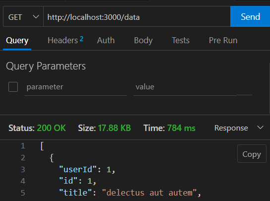
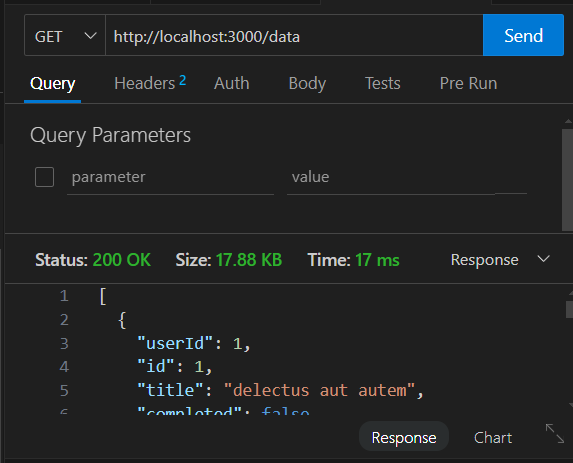

## without redis

## with redis


## running redis/redis container
```
docker run -p 6379:6379 -p 8081:8081 --name redis-stack redis/redis-stack
```
## data types
String:-
1) setting and getting data
```
set bike:1 ssk nx #set when it not exists
get bike:1 ssk nx
```
 [entity]:[etity_id] value

 ### multiple set and get
 ```
 mset car:1 s car:2 k car:3 sj
 ```
## incr
```
set count 1
inc count
incby count 10
```
## Note:- A single string can be maximum of 512 MB

## List
- command key value
- lpush
- rpush
- lpop
- rpop
- llen-> length of list

## blocking command
wait that time 
- blpop msg 10

## sets
- unordered collection of strings
- sadd key value
- sismember ip 1-> exists or not 1 in ip

## hashes

- hset bike:1 field1 value1
- hget bike1 field1

## sorted add

- zadd score 1 suryansh
- zadd score 2 ayush

## redis streams

- redis has high through put
- notifications
- sensor monitoring
- XADD

## PUB/SUB

- publish channel_name
- subscribe channel_name